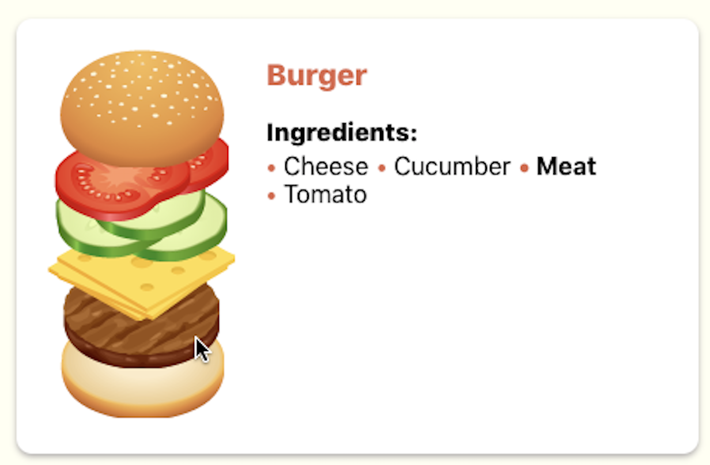

# React Burger

The following is just a prototype of how our `React Burger` should look like!

You will need to perform the following tasks to make this prototype fully functional:

## 1. Recipes should be dynamic!
Our `App` component has a harcoded number of recipes that is currently displaying

```javascript 
function App() {
  return (
    <div className="App">
      <RecipeCard />
      <RecipeCard />
      <RecipeCard />
      <RecipeCard />
      <RecipeCard />
    </div>
  );
}
```

Of course this was useful for prototyping but not anymore. There is a json file `recipes.json` that describes how many recipes are there and exactly what a recipe should look like.


```json
[
    {
        "name": "Double Cheese Burger",
        "ingredients": ["cheese", "meat", "cheese", "meat"]
    },
    {
        "name": "Double Bacon Cheese Burger",
        "ingredients": ["bacon", "cheese", "meat", "cheese", "meat"]
    }
]
```

You should display a `RecipeCard` per recipe in that file. Each recipe has a number of known ingredients and a name. The `RecipeCard` component should be modified to use such name and list of ingredients to render itself, its list of ingredients and the associated picture.

You need to be aware of the following considerations:

1. Bread is always included: It is not part of the recipe but it should be displayed in the picture.
2. Order is important: When displaying the burger picture keep in mind that **first ingredient** in the list should be displayed **on top** of the element that is second.
3. The text list of ingredients should display all the burger ingredients in **alphabetic order** with **no duplicates**

> Note: For the sake of simplicity you can import the json file statically. No asynchronic fetch is needed at this point.

## 2. Hover feels odd
Right now the picture of the burger expands when the user hovers over the it. This has been done using the css pseudo-selector `:hover`. We want to change that so the whole `RecipeCard` expands when the user hovers it.

Keep in mind that:
1. Clicking again on an opened card should close it.
2. Only one card can be opened at the same time. Opening a different card closes the one that was previously open.

## 3. A little feedback
There is a new requirement: when hovering an ingredient in the burger picture the text that describes such ingredient in the list of ingredients should be highlighted



## 4. Tags
We want to add a section under the list of ingredients that displays certain tags if the burger recipe meets some requirements

* Vegan: A vegan burger doesn't have `meat`, `cheese` or `bacon` among its ingredients.
* Veggie: A veggie buger doesn't have `meat` or `bacon` among its ingredients.
* Lactose-free: A lactose-free ingredient doesn't have `cheese` among its ingredients.
* Eat-at-your-won-risk: Any burger with more than more than six ingredients in the following category should display this tag: `meat`, `cheese` or `bacon` 

One more thing: Tags should be only visible when the Recipe is opened 

Once completed the final web should look like this:

